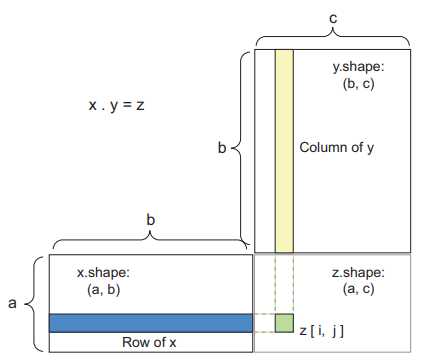

# 2.1 Concepts

**Layers:** Data processing module that you can think as a filter for data. They extract *representations* out of data fed to them.

**Dense layers:** Layers which are densely connected (also called *fully connected*)

**Softmax layer:** Layer that returns probability scores.

* **Loss function:** How the network will be able to measure its performance on the training data.
* **Optimizer:** Mechanism throughwhich the network will update itself based on the data and loss function.
* **Metrics to monitor during training and testing:** Generally it's accuracy.

**Overfitting:** The fact that machine-learning models tend to perform worse on new data than on their training data.

# 2.2 Data representations for neural networks

## Tensors

Container of data (almost always numerical). Generalization of matrices to an arbitrary number of dimentions.

* **Scalars (0D tensors):** Tensor that contains only one number.
* **Vectors (1D tensors):** An array of numbers. It has exactly one axis.
* **Matrices (2D tensors):** It has 2 axes. Visually interpreted as a rectangualr grid of numbers.
* **3D Vectrs and higher-dimentional tensors:** If you pack such matrices in a new array, you obtain a 3D tensor. Visually interpreted as a cube.

```python
>>> x = np.array([[[5, 78, 2, 34, 0],
[6, 79, 3, 35, 1],
[7, 80, 4, 36, 2]],
[[5, 78, 2, 34, 0],
[6, 79, 3, 35, 1],
[7, 80, 4, 36, 2]],
[[5, 78, 2, 34, 0],
[6, 79, 3, 35, 1],
[7, 80, 4, 36, 2]]])
>>> x.ndim
3
```

**Dimensionality:** Can denote either the number of entries along a specific axis or the number of axes in a tensor.

### Key atributes

A tensor is defined by 3 key attributes:

* **Number of axes (rank):** . This is also called the tensor’s `ndim` in Python libraries such as Numpy.

  ```python
  >>> print(train_images.ndim)
  3
  ```
* **Shape:** Tuple of integers that describes how many dimensions the tensor has along each axis.

  ```python
  >>> print(train_images.shape)
  (60000, 28, 28)
  ```
* **Data type:** Type of data contained in the tensor; for instance, a tensor’s type could be `float32`, `uint8`, `float64`, and so on. Usually called `dtype` in Python libraries.

  ```python
  >>> print(train_images.dtype)
  uint8
  ```

### Manipulating tensors in Numpy

**Tensor slicing:** Selecting a range of data in a tensor.

```python
my_slice = train_images[10:100]
```

In general, you may select between any two indices along each tensor axis.

```python
my_slice = train_images[:, 14:, 14:]
```

### Data batches

Deep-learning models don’t process an entire dataset at once; rather,
they break the data into small batches.

When considering a batch tensor, the first axis (axis 0) is called the **batch axis** or **batch dimension**.

# 2.3 Tensor operations

Layers can be interpreted as a function like this:

```python
output = relu(dot(W, input) + b)
```

## **Element-wise operations**

Operations that are applied independently to each entry in the tensors being considered. Highly optimized.

```python
import numpy as np
z = x + y #Element-wise addition
z = np.maximum(z, 0.) #Element-wise relu
```

**Broadcasting:** When possible, and if there’s no ambiguity, the smaller tensor will be broadcasted to match the shape of the larger tensor. Broadcasting consists of two steps:

1. Axes (called broadcast axes) are added to the smaller tensor to match the ndim of the larger tensor.
2. The smaller tensor is repeated alongside these new axes to match the full shape of the larger tensor

## Tensor dot

Most useful. It combines entries in the input tensors.

```python
import numpy as np
z=np.dot(x,y)
```

To understand dot-product shape compatibility, it helps to visualize the input and output tensors by aligning them.



## Tensor reshaping

Reshaping a tensor means rearranging its rows and columns to match a target shape.
Naturally, the reshaped tensor has the same total number of coefficients as the initial tensor.

```python
x = x.reshape((x,y,...))
```

**Transposition:** Exchanging rows and columns.

# 2.4 Gradient-based optimization

Each neural layer transforms input data as follows:

```python
output = relu(dot(W, input) + b)
```

**W** and **b** are tensors that are attributes of the layer. They are **weigths** or **trainable parameters** of the layer. They contain the information learned by the network from exposure to training data.

**Random initialization:** Fil the initial weights with small random numbers.
