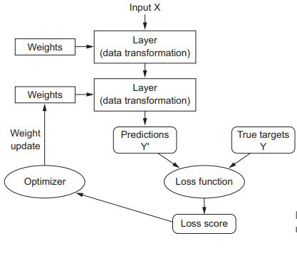

# 3.1 Anatomy of a neural network

Training a neural network revolves around:

* **Layers**, which are combined into a **network**.
* The **input data** and corresponding **targets**.
* The **loss function**, which defines the feedback signal used for learning.
* The **optimizer**, which dtermines how learning proceeds

## Layers

A **layer** is a data-processing module that takes as input one or more tensors and outputs one or more tensors.

Different layers are appropiate for different tensor formarts and different types of data processing

* Simple vector data, 2D shape -> **densely connected layers**
* Sequence data, 3D shape -> **recurrent layers**
* Image data, 4D shape -> **2D convolution layers**

Building deep-learning models is done by clipping together compatible layers to form userful data-transformation pipelines.

**Layer compatibility** refers specifically to the fact that every layer will only accept input tensors of a certain shape and will return output tensors of a certain shape.
